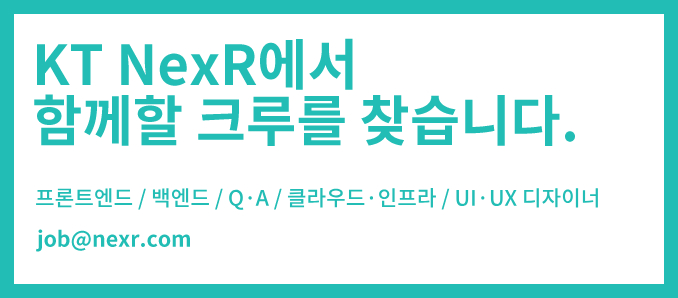

## NexR R&D Github 홈페이지에 오신 모든 분들을 환영합니다.

kt NexR은 빅데이터와 관련된 모든 것을 다루는 회사입니다. 10년 이상 축적된 경험 및 빅데이터 전문기술을 바탕으로 빅데이터 시스템 구성부터 통합까지 엔터프라이즈 환경에 최적화된 올인원(All-In-One) 서비스를 제공하는 기업입니다.  kt NexR은 빅데이터 처리 플랫폼 뿐만 아니라, 분석/운용/설치/기술지원 등에 필요한 전문인력을 보유하고 있으며 이를 바탕으로 기업 환경에서 효과적으로 데이터를 활용할 수 있도록 최상의 해답을 제공하기 위해 노력하고 있습니다.

### R&D 센터

안녕하세요. kt NexR의 빅데이터 솔루션 개발을 총괄하고 있는 diesel입니다. kt NexR은 지난 10년동안 빅데이터 배치 처리 솔루션인 NDAP과 실시간/AI 솔루션인 Lean Stream을 개발하며 대한민국의 빅데이터 시장을 이끌어 왔습니다. kt NexR은 2019년을 또 하나의 원년으로 삼고 빅데이터 도메인 기술이 집약된 솔루션을 만들기 위해 Constantine Project를 진행하고 있습니다. 이에 서로 도우며 성장하고 자신의 역량과 가능성을 펼치고 싶어하는 창작자 여러분을 모집하고 있습니다. 여러분은 강력한 멘탈 케어 환경에서 자유와 책임감으로 무장하고 일해 본 경험이 있으신가요? kt NexR의 R&D 센터에서 한번 경험해보시면 어떨까요?

### 주요 업무
- 빅데이터 신규 솔루션 개발(Constantine Project)
- 빅데이터 신규 솔루션 백엔드 서버 개발
- 빅데이터 신규 솔루션 프론트엔드 UI 개발
- UI/UX 디자인
- 오픈소스 연구 조사
  - 솔루션 개발과 관련된 모든 오픈소스
  
## Creator’s Playground STATEMENT
kt NexR R&D 센터가 가진 인재상이자 반드시 지켜야 할 우리들의 약속입니다! 함께 일할 팀에서는 어떤 가치를 중요시 하는지 살펴볼 수 있습니다.

[자세히 보러가기](./docs/statement/README.md)

  
## kt NexR R&D 센터 문화 엿보기
- 더 팀스: <https://www.theteams.kr/teams/2805>
- 월간 리너 매거진: <https://brunch.co.kr/magazine/ktnexr>

## kt NexR 복지
kt NexR에 입사하시면 다음과 같은 복지를 누릴 수 있습니다. 자세한 내용은 링크를 확인해 주세요.

[kt NexR 복지 확인 하기](./docs/welfare/README.md)

## kt NexR 관련 홍보 자료
- 린스트림을 이용한 커스텀 대시보드 예제:  <https://youtu.be/nWzplzzKuaI>
- MSTR korea 발표 현장: <https://youtu.be/D8ajxM09Afw>
- Lean Stream 공식 홍보 동영상: <https://youtu.be/Krpni4Izj68>
- YTNSCIENCE 4차산업혁명 사물인터넷 세상에 살다 인터뷰 영상: <https://youtu.be/CdHsnCJLOx0>

## kt NexR R&D 센터 저술 활동
- 스파크 완벽 가이드(<https://bit.ly/2IFZerC>)
- 엔터프라이즈 데이터 레이크 구축(<https://bit.ly/2NwHmy8>)
- 하이브 완벽 가이드(<http://bit.ly/2EgCUzs>)

## 채용 분야

### 백엔드 엔지니어
Java로 세상을 지배하고 싶은 사람의 영역입니다. 자사 솔루션 백엔드 개발에서 부터 빅데이터 오픈소스 Tracking까지 비교적 넓은 영역을 담당합니다. 

[세부 정보 확인 하기](./docs/job/backend/README.md)

### 프론트 엔지니어
Javascript로 세상을 지배하면서 html과 css 체계를 이해하고 사용하는 사람의 영역입니다.  웹 UI를 통해 고객에게 빅데이터 솔루션의 사용 가치를 높여주는 매우 중요한 역할입니다.

[세부 정보 확인 하기](./docs/job/frontend/README.md)

### QA 엔지니어
개발된 빅데이터 솔루션의 기능을 가장 처음으로 사용해볼 수 있는 영역입니다. 신규 기능 테스트 및 기존 기능과의 호환성을 확인하여 솔루션의 완성도를 더욱 더 높여주는 매우 중요한 역할입니다. 통합 테스트 인프라 구축 및 컨테이너 가상화 등 다양한 환경을 지원하는 역할도 함께 합니다.

[세부 정보 확인 하기](./docs/job/qa/README.md)

### Cloud/Infra
Cloud/k8s/Docker로 솔루션이 설치되는 환경의 제약을 없애는 사람의 영역입니다. 현재 dedi 환경에 갇혀 더 넓은 세상으로 뻗어나가지 못하고 힘들어하는 우리 솔루션들에게 새로운 가능성을 열어주는 너무나도 중요한 역할입니다.

[세부 정보 확인 하기](./docs/job/cloud/README.md)

### UI/UX Designer
감각으로 무장하고 개발자들이 만들어낼 강력한 솔루션에 생기를 불어넣는 역할을 수행합니다. 아름다움으로 빅데이터 세상을 뒤집어 놓아야 하는 매우 중요한 영역입니다.

[세부 정보 확인 하기](./docs/job/designer/README.md)

### 입사 지원서
[입사지원서 다운로드](./files/kt_nexr_resume.docx)

## Contact
* kt NexR 홈페이지: http://www.ktnexr.com
* Q&A: rnd@nexr.com
* 입사 지원 E-Mail: job@nexr.com
