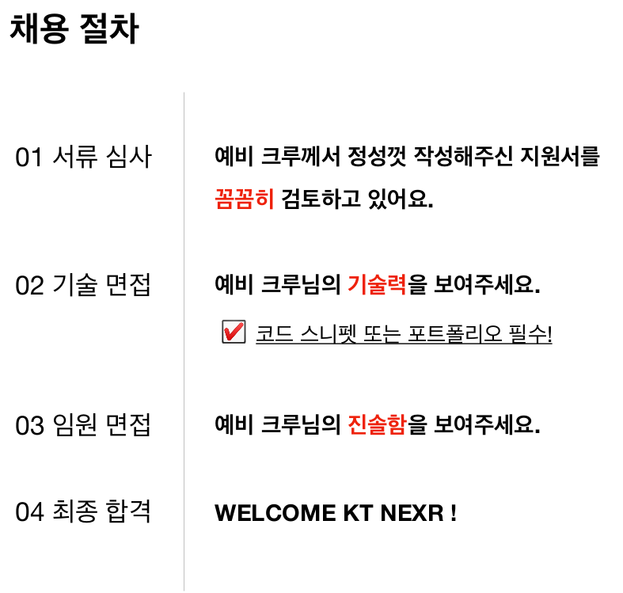

# 클라우드/인프라 엔지니어
Cloud/k8s/Docker 기술을 무기로 솔루션이 설치되는 환경의 제약을 없애는 사람의 영역입니다. 현재 dedi 환경에 갇혀 더 넓은 세상으로 뻗어나가지 못하고 힘들어하는 우리 솔루션들에게 새로운 가능성을 열어주는 너무나도 중요한 역할입니다.

## 채용 인원
- 채용이 종료되었습니다.

## Role
-  Docker/k8s 등 클라우드/컨테이너 환경 구축
- 클라우드/컨테이너 인프라 자동화 및 확장 기능 개발
- 클라우드/컨테이너 인프라 모니터링 및 모니터링 기술 개발

## 이 정도가 최소 요구사항입니다.
- OpenStack/CloudStack 기술에 대한 이해 및 적용 경험
- Docker/k8같은 컨테이너 기술에 대한 이해 및 적용 경험
- Linux kernel 에 대한 이해

# 전형절차

# 입사 지원서
[입사지원서 다운로드](../../../files/kt_nexr_resume.docx)

# 입사 지원 하기
E-Mail: <job@nexr.com>
파일 첨부시 파일명은 "지원분야_성명"으로 지정해 주세요.